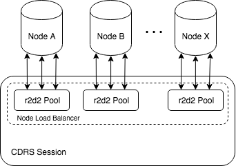

# CDRS Session

`Session` is a structure that holds as set pools of connections authorised by a Cluster. As well it provides data decompressing and load balancing mechanisms used for Cassandra frame exchange, or querying in other words.

```rust
use cdrs::load_balancing::RoundRobin;
use cdrs::cluster::session::{new as new_session};


let load_balancing = RoundRobin::new();
let session = new_session(&cluster_config, RoundRobin::new())
  .expect("session should be created");
```

Here, in order to create new session a [cluster config](./cluster-configuration.rs) and a load balancing strategy must be provided. Load balancing strategy is used when some query should be performed by driver. At that moment load balancer returns a pool of connections for a node that was picked up in accordance to a strategy. After that CDRS gets from r2d2 pool one of available connections, and then this connection will be used for frames exchange. Such logic guarantees that nodes' loads are balanced and there is no need to establish new connection if there is a one that is released after previous query.

This is how the architecture looks like:

<p align="center">
  
</p>

## Load balancing

Any structure that implements `LoadBalancingStrategy` trait can be used in `Session` as a load balancer.

CDRS provides few strategies out of the box so no additional development may not be needed:

- `cdrs::load_balancing::Random` randomly picks up a node from a cluster.

- `cdrs::load_balancing::RoundRobinSync` thread safe round robin balancing strategy.

- `cdrs::load_balancing::RoundRobin` light weight round robin strategy that is not thread safe though. So it should be used in mono thread apps only.

Along with that any custom load balancing strategy may be implemented and used with CDRS. The only requirement is the structure must implement `LoadBalancingStrategy` trait.

## Data compression

CQL binary protocol allows using LZ4 and Snappy data compression in order to reduce trafic between Node and Client.

CDRS provides methods for creating `Session` with different compression contexts:

- `cdrs::session::new(&cluster_config, load_balancer)` creates new `Session` that will be exchanging non-compressed frames with a Cluster.

- `cdrs::session::new_snappy(&cluster_config, load_balancer)` creates new `Session` that will be exchanging Snappy-compressed frames with a Cluster.

- `cdrs::session::new_lz4(&cluster_config, load_balancer)` creates new `Session` that will be exchanging LZ4-compressed frames with a Cluster.

Once `Session` is successfully created it can be used for communication with Cluster.

## Making queries

By default `Session` structure doesn't provide an API for making queries. Query functionality bacomes enabled after importing one or few of following traits:

```rust
use cdrs::query::QueryExecutor;
```

```rust
use cdrs::query::PrepareExecutor;
```

```rust
use cdrs::query::ExecExecutor;
```

```rust
use cdrs::query::BatchExecutor;
```

Detailed Query API and those traits overview please find in [making query](./making-query.rs) section.

### Reference

1. LZ4 compression algorythm https://en.wikipedia.org/wiki/LZ4_(compression_algorithm).

2. Snappy compression alhorythm https://en.wikipedia.org/wiki/Snappy_(compression).
